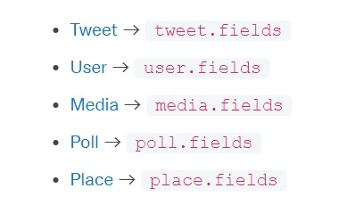

# 最もシンプルなtwitter APIプログラミング

簡単なキーワード抽出。 この方法では、本文やidなど基本的な情報だけが抽出される。
[参考サイト](https://developer.twitter.com/en/docs/twitter-api/tweets/search/introduction)

[get_tweet_json.py](get_tweet_json.py)
``` python
query = '一番搾り'
url = f'https://api.twitter.com/2/tweets/search/recent?query={urllib.parse.quote(query)}'

# 認証はbearer tokenだけでOK  
bearer_token = ''
headers = {'Authorization': f'Bearer {bearer_token}'}
# API実行 GETプロトコルを指定している
# 
response = requests.request('GET', url, headers=headers)
result = json.loads(response.content.decode('utf-8'))
print(json.dumps(result, indent=4, ensure_ascii=False))
```
# paramsを使った複雑なデータ抽出
paramsに記述できるパラメータ仕様は, X developer platform の[Fields](https://developer.twitter.com/en/docs/twitter-api/fields) 中の以下のリンクを辿ると詳細な説明がある。  
[get_tweet_json_params.py](get_tweet_json_params.py)


``` python
# 検索条件
url = f'https://api.twitter.com/2/tweets/search/recent'
# 認証
bearer_token = ''
headers = {'Authorization': f'Bearer {bearer_token}'}
# API実行
# paramsで抽出条件を細かく指定している。
params = {'query':'一番搾り',                    
                    'expansions': 'author_id,in_reply_to_user_id,geo.place_id',
                    'tweet.fields': 'id,text,author_id,in_reply_to_user_id,geo,conversation_id,created_at,lang,public_metrics,referenced_tweets,reply_settings,source',
                    'user.fields': 'id,name,username,created_at,description,public_metrics,verified',
                    'place.fields': 'full_name,id,country,country_code,geo,name,place_type',
                    'next_token': {}}
response = requests.request("GET", url, headers = headers, params = params)
result = json.loads(response.content.decode('utf-8'))
print(json.dumps(result, indent=4, ensure_ascii=False))
```